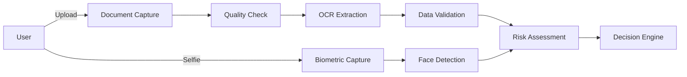

# Data Protection Impact Assessment (DPIA)

**Generated:** 2025-08-14T13:08:23.692246+08:00
**System:** KYC Identity Verification System
**Version:** 1.0.0

## Executive Summary

This Data Protection Impact Assessment evaluates the privacy risks associated with the KYC Identity Verification System. The system processes personal data including biometric information for identity verification and fraud prevention purposes.

## 1. Processing Overview

### 1.1 Purpose of Processing

The primary purposes of data processing are:
- **Identity Verification**: Capture and assess quality of identity documents
- **Identity Verification**: Extract text data from identity documents using OCR
- **Fraud Prevention**: Compare face from document with selfie
- **Regulatory Compliance**: Screen against sanctions and PEP lists
- **Risk Assessment**: Calculate risk scores based on multiple factors
- **Audit and Logging**: Log all system activities for audit trail
- **Identity Verification**: Verify document authenticity with issuing authority
- **Fraud Prevention**: Analyze device characteristics for fraud detection

### 1.2 Lawful Basis

Processing is conducted under the following lawful bases:
- **Contract Performance**: 3 processing activities
- **Legitimate Interests**: 3 processing activities
- **Legal Obligation**: 2 processing activities

## 2. Data Inventory

### 2.1 Categories of Personal Data

#### Identity Data

| Field Name | Description | PII | Sensitive | Retention |
|------------|-------------|-----|-----------|-----------|
| full_name | Full legal name of the individual | Yes | No | 2555 days |
| birth_date | Date of birth | Yes | No | 2555 days |
| nationality | Nationality/Citizenship | Yes | No | 2555 days |

#### Government ID Data

| Field Name | Description | PII | Sensitive | Retention |
|------------|-------------|-----|-----------|-----------|
| id_number | Government-issued ID number | Yes | Yes | 2555 days |
| passport_number | Passport number | Yes | Yes | 2555 days |

#### Biometric Data

| Field Name | Description | PII | Sensitive | Retention |
|------------|-------------|-----|-----------|-----------|
| face_image | Facial image for biometric verification | Yes | Yes | 90 days |
| face_encoding | Mathematical representation of facial features | Yes | Yes | 90 days |

#### Contact Data

| Field Name | Description | PII | Sensitive | Retention |
|------------|-------------|-----|-----------|-----------|
| email | Email address | Yes | No | 2555 days |
| phone_number | Phone number | Yes | No | 2555 days |
| address | Physical address | Yes | No | 2555 days |

#### Device/Technical Data

| Field Name | Description | PII | Sensitive | Retention |
|------------|-------------|-----|-----------|-----------|
| ip_address | IP address of the device | Yes | No | 180 days |
| device_id | Unique device identifier | Yes | No | 365 days |
| user_agent | Browser/app user agent string | No | No | 90 days |

#### Location Data

| Field Name | Description | PII | Sensitive | Retention |
|------------|-------------|-----|-----------|-----------|
| gps_coordinates | GPS coordinates | Yes | No | 30 days |

#### Behavioral Data

| Field Name | Description | PII | Sensitive | Retention |
|------------|-------------|-----|-----------|-----------|
| risk_score | Calculated risk score | No | No | 2555 days |
| verification_attempts | Number and pattern of verification attempts | No | No | 365 days |

### 2.2 Data Sources

- Barcode
- Device Fingerprinting
- Device GPS
- Document Image
- Document OCR
- Face Detection Algorithm
- HTTP Headers
- IP Geolocation
- MRZ
- NFC
- Network Connection
- Risk Engine
- Selfie
- System Logs
- User Input

## 3. Data Flow

### 3.1 Data Collection


### 3.2 Data Recipients

- AML Service Providers
- Auditors
- Biometric Service Provider
- Fraud Detection Service
- Government Agencies
- Internal Risk Engine
- Internal Systems
- Issuer APIs
- OCR Service Provider
- Regulators
- Regulators (when required)

### 3.3 International Transfers

The following activities involve international data transfers:
- **AML Sanctions Screening**: United States, United Kingdom

## 4. Risk Assessment

### 4.1 Identified Risks

| Risk ID | Description | Likelihood | Impact | Score | Residual Risk |
|---------|-------------|------------|--------|-------|---------------|
| RISK-001 | Unauthorized access to biometric data | Low | High | 6 | Low |
| RISK-002 | Data breach exposing PII | Medium | High | 8 | Medium |
| RISK-003 | Excessive data retention | Medium | Medium | 5 | Low |
| RISK-004 | Third-party data processor breach | Low | High | 6 | Low |
| RISK-005 | Algorithmic bias in risk scoring | Medium | Medium | 5 | Low |
| RISK-006 | Cross-border data transfer compliance | Low | Medium | 4 | Low |

### 4.2 Risk Matrix
```
Impact    High  | 3 | 6 | 9 |
         Medium | 2 | 5 | 8 |
          Low   | 1 | 4 | 7 |
                +---+---+---+
                Low Med High
                Likelihood
```

## 5. Mitigation Measures

### RISK-001: Unauthorized access to biometric data

**Mitigation measures:**
- Encryption at rest and in transit
- Multi-factor authentication for access
- Regular access reviews
- Biometric template protection

### RISK-002: Data breach exposing PII

**Mitigation measures:**
- End-to-end encryption
- Network segmentation
- Intrusion detection systems
- Regular security audits
- Incident response plan

### RISK-003: Excessive data retention

**Mitigation measures:**
- Automated retention policies
- Regular data purging
- Retention period reviews
- Data minimization practices

### RISK-004: Third-party data processor breach

**Mitigation measures:**
- Vendor security assessments
- Data processing agreements
- Regular audits of processors
- Contractual security requirements

### RISK-005: Algorithmic bias in risk scoring

**Mitigation measures:**
- Regular bias testing
- Algorithm transparency
- Human review for edge cases
- Fairness metrics monitoring

### RISK-006: Cross-border data transfer compliance

**Mitigation measures:**
- Standard Contractual Clauses
- Adequacy decisions review
- Transfer impact assessments
- Local data residency options

## 6. Technical and Organizational Measures

### 6.1 Technical Measures
- Access controls
- Access restrictions
- Algorithm transparency
- Audit logging
- Biometric template protection
- Certificate pinning
- Data agreements
- Data minimization
- Device fingerprinting
- Encrypted transmission
- Encryption
- Encryption at rest
- Encryption in transit
- Fairness testing
- Hash chains
- IP anonymization
- Regular audits
- Secure APIs
- Secure deletion
- Secure storage
- WORM storage

### 6.2 Organizational Measures
- Privacy by Design principles
- Data Protection Officer appointment
- Regular privacy training
- Privacy policies and procedures
- Incident response plan
- Regular audits and assessments

## 7. Data Subject Rights

The system supports the following data subject rights:
- **Right to Access**: Data export functionality
- **Right to Rectification**: Data correction interfaces
- **Right to Erasure**: Data deletion procedures
- **Right to Restriction**: Processing limitation controls
- **Right to Portability**: Structured data export
- **Right to Object**: Opt-out mechanisms

## 8. Compliance

### 8.1 Regulatory Compliance
- **GDPR**: General Data Protection Regulation (EU)
- **Data Privacy Act**: Republic Act 10173 (Philippines)
- **BSP Circular 808**: Guidelines on Information Security Management
- **PCI DSS**: Payment Card Industry Data Security Standard

### 8.2 Code Analysis Results

- Files scanned: 39
- PII fields identified: 11
- API endpoints: 18

## 9. Recommendations

1. **Immediate Actions:**
   - Implement automated data retention policies
   - Enhance biometric data protection
   - Complete privacy notices update

2. **Short-term (3 months):**
   - Conduct penetration testing
   - Implement privacy-preserving analytics
   - Enhance consent management

3. **Long-term (12 months):**
   - Achieve ISO 27001 certification
   - Implement homomorphic encryption
   - Establish privacy metrics dashboard

## 10. Approval and Review

| Role | Name | Date | Signature |
|------|------|------|-----------|
| Data Protection Officer | ____________ | ____________ | ____________ |
| Chief Technology Officer | ____________ | ____________ | ____________ |
| Legal Counsel | ____________ | ____________ | ____________ |

**Next Review Date:** 6 months from approval