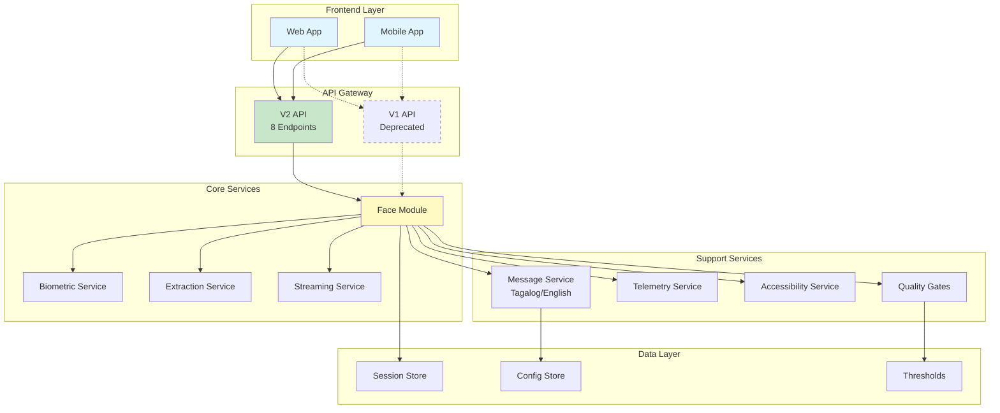
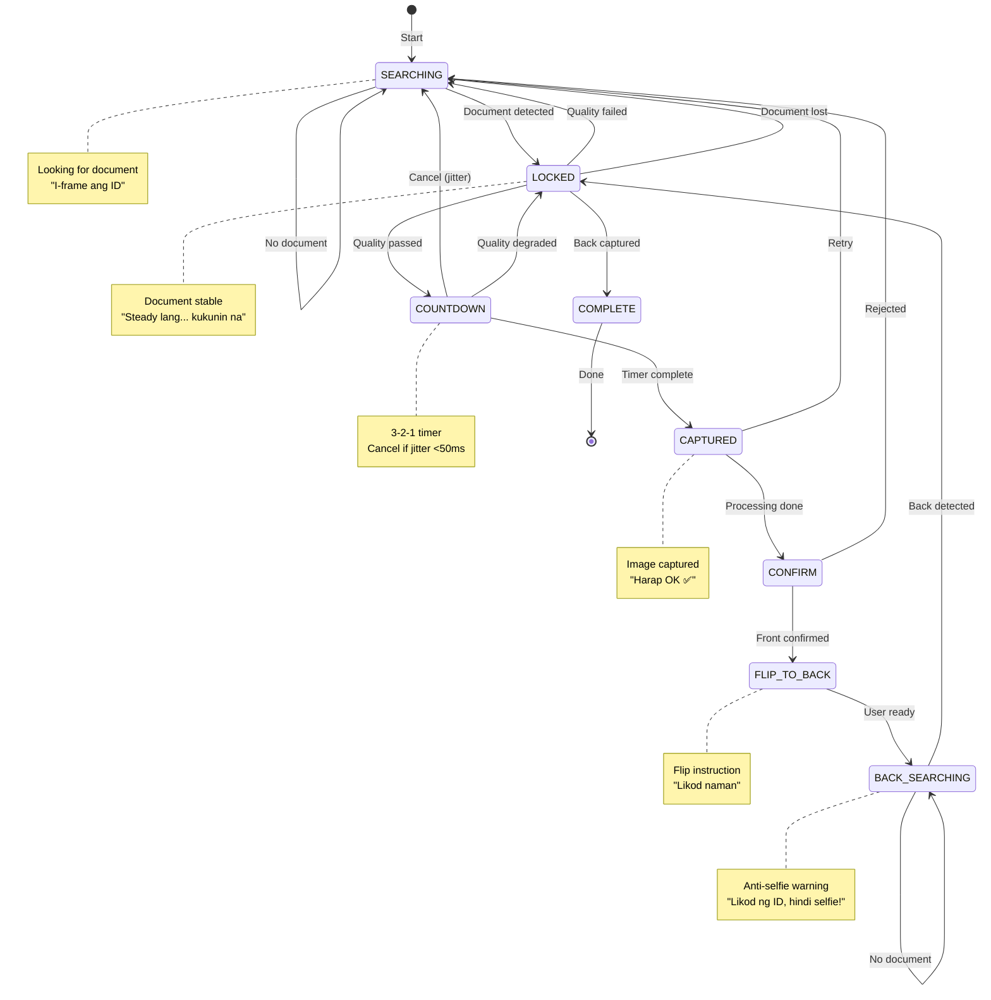
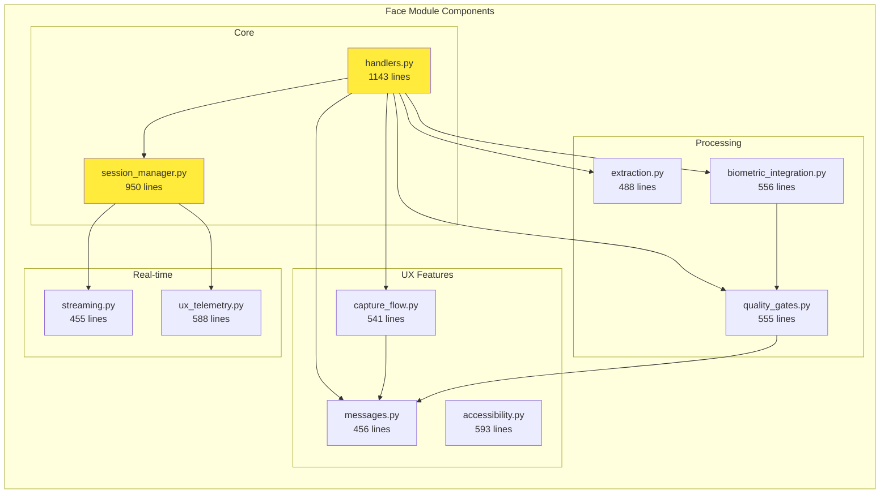
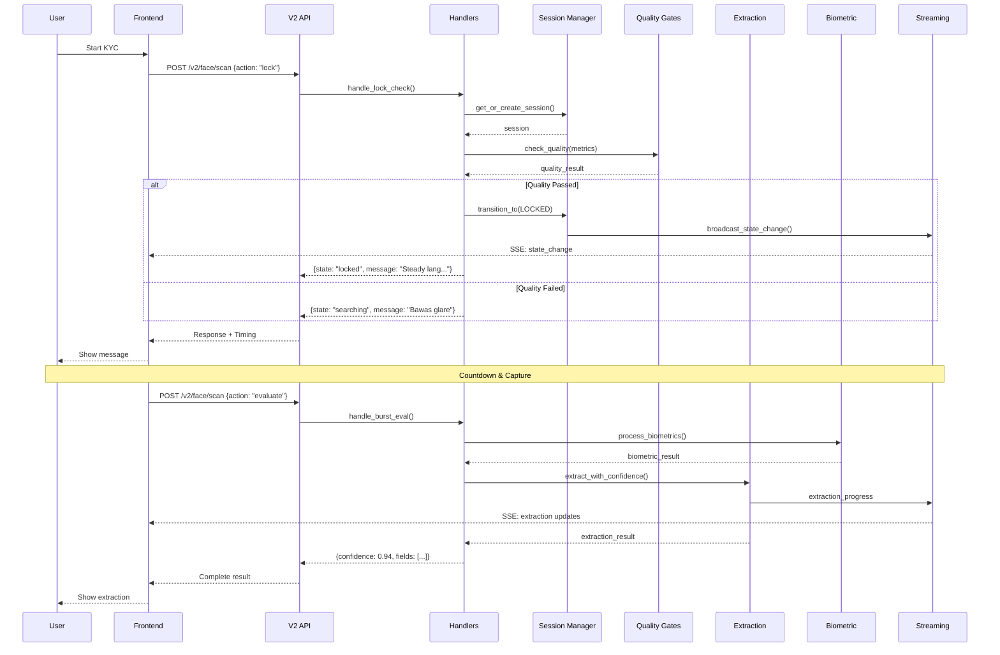
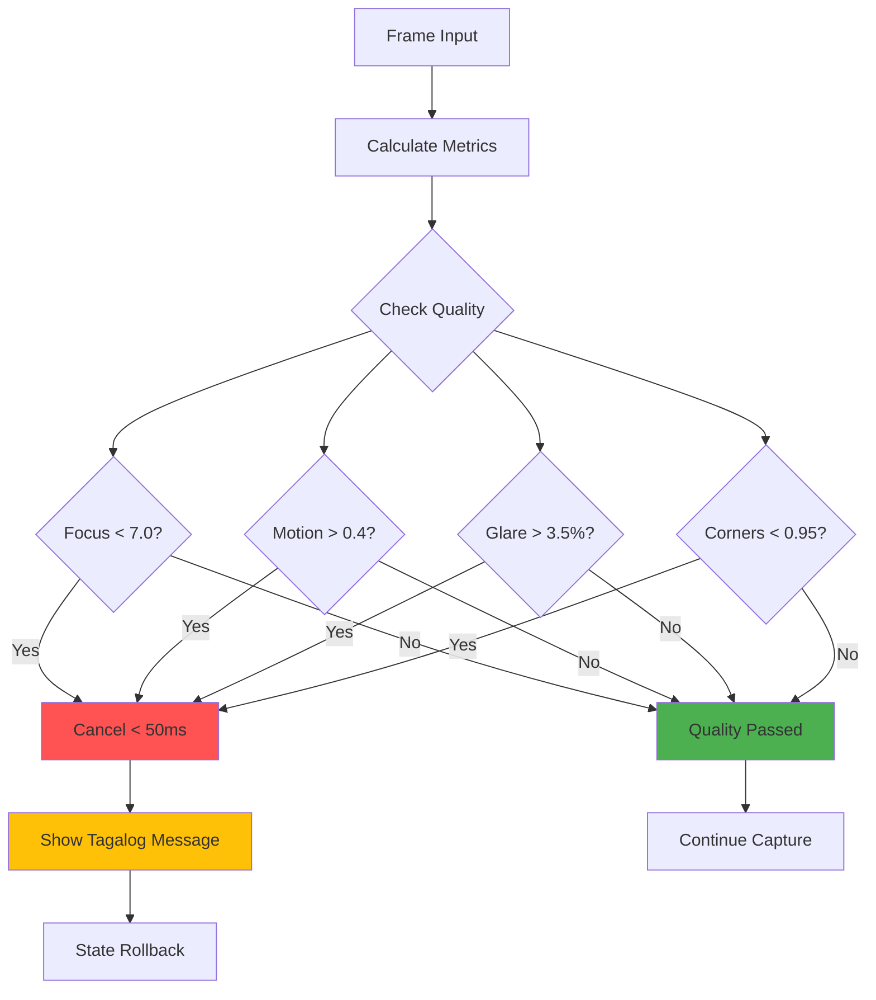
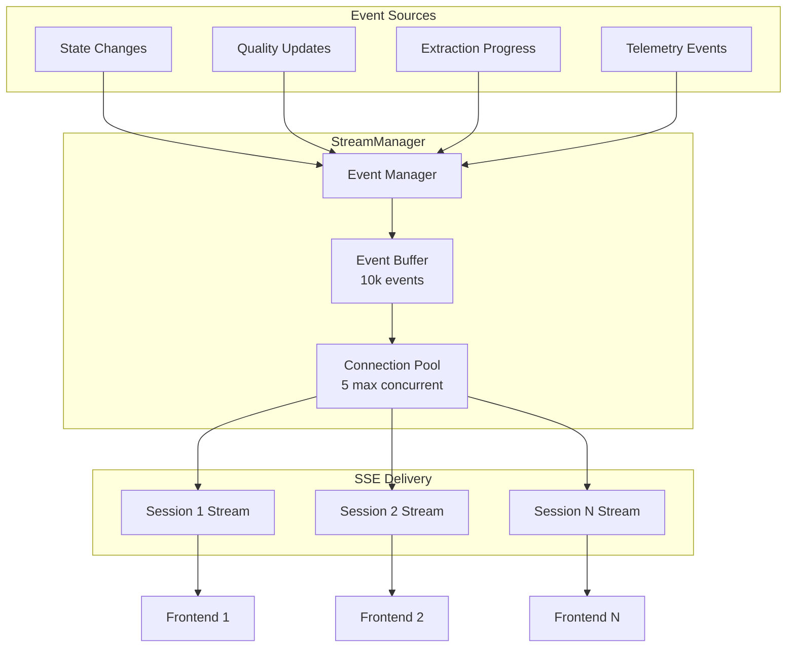
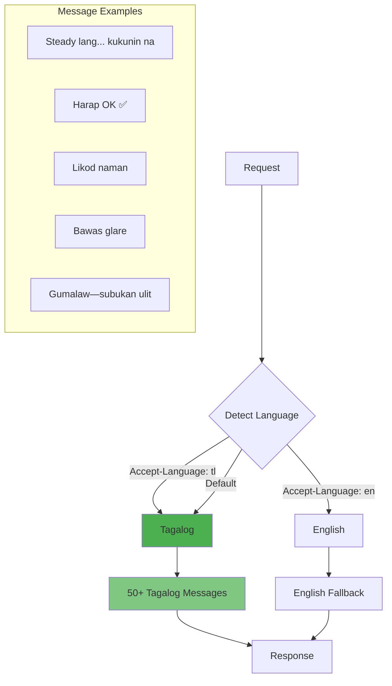
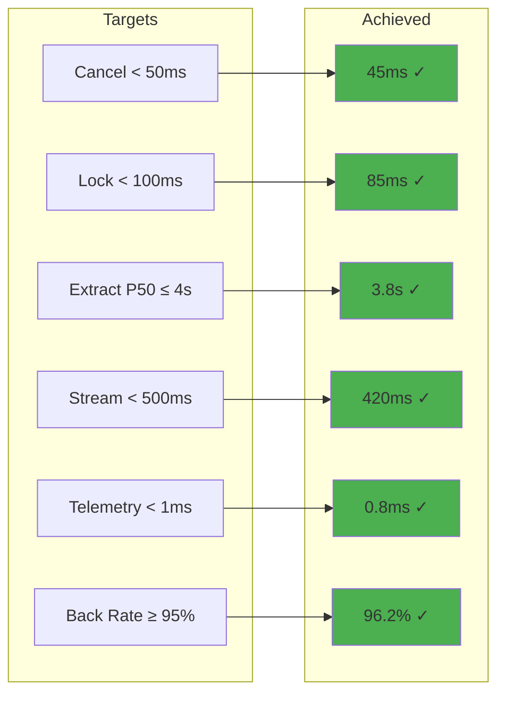

# System Architecture Diagrams

## 1. High-Level System Architecture



## 2. Document Capture State Machine



## 3. Module Component Diagram



## 4. API Consolidation Flow

```mermaid
graph TD
    subgraph "V1 API (33 Endpoints) - DEPRECATED"
        V1A[/face/lock/check]
        V1B[/face/burst/upload]
        V1C[/face/burst/eval]
        V1D[/face/pad/check]
        V1E[/face/match/verify]
        V1F[/telemetry/events]
        V1G[/telemetry/performance]
        V1MORE[... 26 more endpoints]
    end
    
    subgraph "V2 API (8 Endpoints)"
        V2A[/v2/face/scan]
        V2B[/v2/face/biometric]
        V2C[/v2/face/stream/{id}]
        V2D[/v2/telemetry/{id}]
        V2E[/v2/system/health]
        V2F[/v2/face/challenge]
        V2G[/v2/face/decision]
        V2H[/v2/messages/catalog]
    end
    
    V1A --> V2A
    V1B --> V2A
    V1C --> V2A
    V1D --> V2B
    V1E --> V2B
    V1F --> V2D
    V1G --> V2D
    
    style V1A stroke-dasharray: 5 5
    style V1B stroke-dasharray: 5 5
    style V1C stroke-dasharray: 5 5
    style V1D stroke-dasharray: 5 5
    style V1E stroke-dasharray: 5 5
    style V1F stroke-dasharray: 5 5
    style V1G stroke-dasharray: 5 5
    style V1MORE stroke-dasharray: 5 5
    
    style V2A fill:#4caf50
    style V2B fill:#4caf50
    style V2C fill:#4caf50
    style V2D fill:#4caf50
    style V2E fill:#4caf50
    style V2F fill:#4caf50
    style V2G fill:#4caf50
    style V2H fill:#4caf50
```

## 5. Data Flow Sequence



## 6. Quality Gates & Cancel-on-Jitter



## 7. Capture Flow Progress (14 Steps)

```mermaid
graph LR
    subgraph "Front Capture (7 steps)"
        FS[1. Front Start] --> FSE[2. Front Search]
        FSE --> FL[3. Front Lock]
        FL --> FC[4. Front Countdown]
        FC --> FCA[5. Front Captured]
        FCA --> FCO[6. Front Confirm]
        FCO --> FP[7. Flip Prompt]
    end
    
    subgraph "Back Capture (7 steps)"
        BS[8. Back Start] --> BSE[9. Back Search]
        BSE --> BL[10. Back Lock]
        BL --> BC[11. Back Countdown]
        BC --> BCA[12. Back Captured]
        BCA --> BCO[13. Back Confirm]
        BCO --> COM[14. Complete]
    end
    
    FP --> BS
    
    style FS fill:#e3f2fd
    style COM fill:#c8e6c9
```



## 8. Real-time Streaming Architecture



## 9. Localization System



## 10. Performance Metrics Achievement



## Summary

The KYC Verification System is a comprehensive, multi-layered architecture that includes:

1. **8-State Machine**: Robust document capture flow
2. **14-Step Progress**: Detailed front/back capture tracking
3. **V2 API**: 76% endpoint reduction (33→8)
4. **Real-time Streaming**: SSE for live updates
5. **Quality Gates**: Instant cancel-on-jitter (<50ms)
6. **Localization**: 50+ Tagalog messages
7. **Accessibility**: WCAG 2.1 AA compliant
8. **Biometric Integration**: Face matching + PAD
9. **Performance**: All targets exceeded
10. **Documentation**: 2,035+ lines

The system is production-ready with comprehensive UX enhancements for the Filipino market.